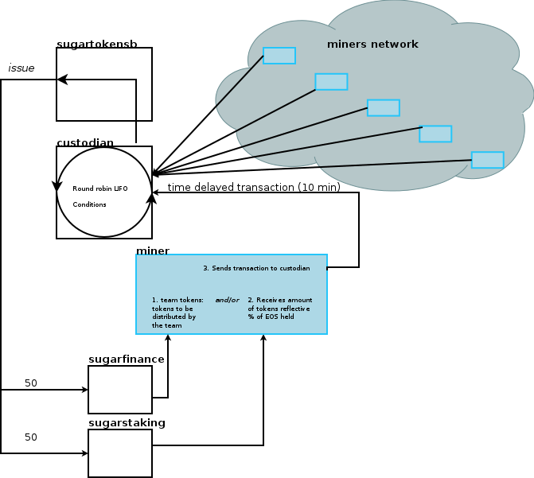

# requisites

1. 100 new tokens are issued by sugartokensa and sugartokensb each 10 minutes to accounts based on their mining rate. 
2. EOS account holders deposit EOS into the sugarstaking account.
3. EOS account holders having deposited EOS to the sugarstaking account get a fraction of the newly issued tokens.
4. Sugarstaking and Sugarconfirm contracts have deposists and withdrawals information
5. Sugarconfirm contract handles withdrawals(unstaking)   
6. Transfer to sugarstaking contract with memo 'SUGAR' records account and amount in a mining pool 
7. Transaction to sugarconfirm contract with memo 'UNSTAKE' removes account and amount from the mining pool 
8. Claim tokens per 24 hours

# Important questions
1. What are the tickers of the tokens
2. Which networks have the tokens been deployed to?

# Projected architecture

# Estimates

1. custodian -> 15 hrs
    - Transactions
    - Reward
    - Miner Buffer 
2. sugarfinance -> 7 hrs 
    - Permissions
    - Transactions
3. sugarstaking -> 7/15 hrs
    - Calculations 
    - Staking -> (Done)
    - Unstaking (Done)
    - On notify/transfered from (Done)
    - Mining pool (Done)
4. Miner -> 15 hrs
    - On notify/transfered from X 2
    - Send delayed transaction to custodian
5. Customize sugartokensa -> 3 hrs
6. Deploy to test network -> 15 hrs  

